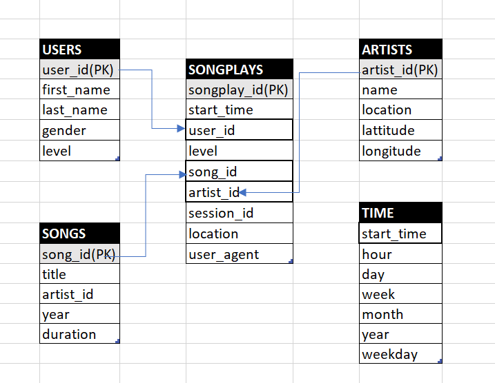

# OVERVIEW:
A startup called Sparkify wants to analyze the data they have been collecting on songs and user activity on their new music streaming app. 
The analytics team is particularly interested in understanding what songs the users are listening to. So they want a database from where they can pull in this data and perform analytics to study the music listening behavior of their users. 

The analytics team have queries which they will use for performing song analysis. We need to design our database so that their queries are optmized and they can easily fetch the data they need. Once we have designed our database schema with a proper ETL pipeline we can test the results comparing with the results they are expecting.

# DATABASE SCHEMA DESIGN:
We are going to create a Postgres database following a star schema for an analytic focus. Our Fact table will be songsplays table. Our dimension tables are Users,Time,Songs,Artists.

# ETL PIPELINE:
We have the data about the songs and the songs users are listening to in JSON format stored in local directories. We are going to process each file and then pull the data and push it to our database that we created as a prior step following the requirement of the analytics team.

# Run Instructions:
1. Launch **create_tables.py** to prepare the database
2. Run **etl.py** to perform data modeling
